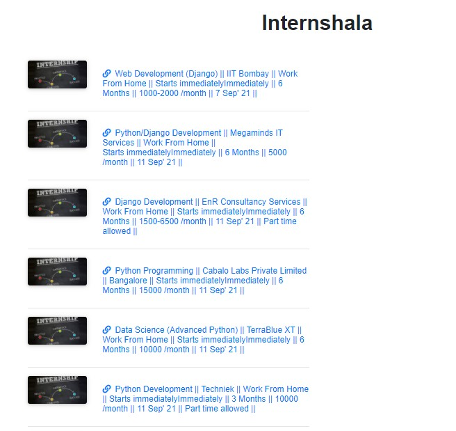

# beautyful-soup-Amazon-scrapping
using Beautyful soup library visit https://djangowebscrapping.herokuapp.com/

## Task
```
Go to internshala.com >
1. Find and store any 10 Jobs in a list dynamically.
2. Extract all the details about all the 10 Jobs using structured data present in Job’s source code. 
3. Store all the details about the job in a local DB (like title, date, etc). 
4. Categorize these events into one of these interest groups.

Repeat the same for : 
https://www.iimjobs.com
https://www.talentrack.in
 
All these 3 websites are Job websites and may or may not support structured data.
Please make 2 tables - non_interesting_url and interesting_url
Interesting_url table should contain the job URLs < the ones you want to scrape.(means the urls in which you can get Job details)
Non_interesting_url should contain “all the other” URLs from the website


```

## Homepage 


## internshala.com


## iimjobs.com


## talentrack.in

